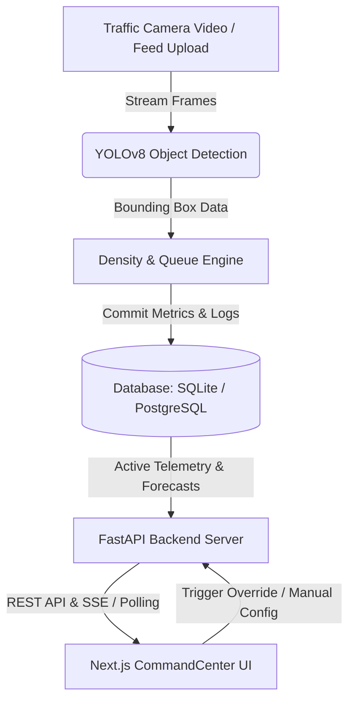

# Aegis Traffic Command 🚦

Aegis Traffic Command is a state-of-the-art **Intelligent Traffic Management System (ITMS)** designed for modern Smart Cities. It integrates real-time computer vision (YOLOv8) with adaptive prioritization and predictive forecasting models to optimize traffic flow, dynamically adjust traffic signals, and orchestrate emergency vehicle green corridors in real-time.

The application features a dark-themed command center interface featuring real-time telemetry HUDs, dynamic traffic vector simulations, and predictive bottle-neck analytics.

---

## 🌟 Key Features

- **📷 Computer Vision & Video Analytics**: Integrates OpenCV and YOLOv8 to process live traffic camera feeds, accurately detect vehicles (cars, motorcycles, buses, trucks), calculate real-time lane density, and estimate queue lengths.
- **🚥 Adaptive Signal Control**: Uses signal intelligence algorithms to compute priority scores based on density, wait times, and upstream vehicle propagation, dynamically allocating optimal green light cycles.
- **🚑 Emergency Preemption (Green Corridors)**: Allows traffic operators to trigger "Green Corridors" (sequential green lights along a path) for emergency vehicles (Ambulance, Fire Truck, Police) to expedite emergency responses.
- **🔮 Predictive Traffic Forecasting**: Uses a forecasting engine to anticipate traffic conditions at 5, 15, and 30-minute intervals using historical and active propagation trends.
- **🗺️ Interactive Command Center**: A sleek, real-time dashboard featuring connection integrity terminals, dynamic network propagation vectors, and interactive control nodes.
- **🔒 Role-Based Access Control (RBAC)**: Secure access clearance levels for Admin, Traffic Operator, and Viewer roles.

---

## 🧱 System Architecture



---

## 🛠️ Tech Stack

### Frontend
* **Framework**: [Next.js 14](https://nextjs.org/) (React, TypeScript, App Router)
* **Styling**: [Tailwind CSS](https://tailwindcss.com/)
* **Icons**: [Lucide React](https://lucide.dev/)

### Backend
* **Framework**: [FastAPI](https://fastapi.tiangolo.com/) (Python 3.10)
* **Server**: [Uvicorn](https://www.uvicorn.org/)
* **ORM & DB**: SQLAlchemy with SQLite (Local default) and PostgreSQL (Production container)
* **AI & Processing**: OpenCV, Ultralytics YOLOv8, NumPy, PyJWT (JWT Auth)

---

## 🔐 Credentials & Access Levels

The system implements Role-Based Access Control (RBAC) to enforce security across operations:

| Username | Password | Role | Clearance Level / Capabilities |
| :--- | :--- | :--- | :--- |
| `admin` | `adminpassword` | **Admin** | Full system administration, configure/create intersections. |
| `operator` | `operatorpassword` | **Traffic Operator** | Trigger emergency green corridors, upload video feeds, override signals. |
| `viewer` | `viewerpassword` | **Viewer** | Read-only telemetry monitoring and metrics lookup. |

---

## 🚀 Getting Started

Ensure you have [Docker](https://www.docker.com/) and [Node.js](https://nodejs.org/) installed on your machine.

### Option A: Quickstart with Docker Compose (Recommended)

To run the entire multi-container stack (Next.js frontend, FastAPI backend, PostgreSQL database) with a single command:

1. Clone this repository:
   ```bash
   git clone https://github.com/your-username/intelligent-traffic-system.git
   cd intelligent-traffic-system
   ```
2. Launch the services:
   ```bash
   docker-compose up --build
   ```
3. Open your browser and navigate to:
   - **Frontend Dashboard**: `http://localhost:3000`
   - **Backend API Docs (Swagger UI)**: `http://localhost:8000/docs`

---

### Option B: Local Manual Setup

If you prefer to run the services individually without Docker:

#### 1. Backend Setup
1. Open a terminal in the `backend` directory:
   ```bash
   cd backend
   ```
2. Create and activate a Python virtual environment:
   ```bash
   python -m venv venv
   # On Windows (PowerShell):
   .\venv\Scripts\Activate.ps1
   # On macOS/Linux:
   source venv/bin/activate
   ```
3. Install dependencies:
   ```bash
   pip install -r requirements.txt
   ```
4. Start the FastAPI server using Uvicorn:
   ```bash
   uvicorn app.main:app --reload --host 127.0.0.1 --port 8000
   ```

#### 2. Frontend Setup
1. Open a new terminal in the `frontend` directory:
   ```bash
   cd frontend
   ```
2. Install npm dependencies:
   ```bash
   npm install
   ```
3. Start the Next.js development server:
   ```bash
   npm run dev
   ```
4. Navigate to `http://localhost:3000` in your web browser.

---

## 🔌 API Endpoints Reference

The FastAPI server exposes Swagger documentation at `http://localhost:8000/docs`. Key routes include:

| Method | Endpoint | Description | Auth Required |
| :--- | :--- | :--- | :--- |
| `POST` | `/api/v1/auth/login` | Authenticate client and retrieve JWT token. | None |
| `GET` | `/api/v1/health` | Check connectivity, database connection, status. | None |
| `GET` | `/api/v1/intersections` | Retrieve list of all registered intersections. | None |
| `POST` | `/api/v1/intersections` | Register a new traffic intersection. | **Admin** |
| `GET` | `/api/v1/intersections/{id}/logs` | Retrieve traffic metrics logging history. | None |
| `POST` | `/api/v1/intersections/{id}/process` | Upload video file to run YOLOv8 processing. | **Traffic Operator** |
| `GET` | `/api/v1/intersections/{id}/signal-state` | Compute dynamic green light priority allocation. | None |
| `GET` | `/api/v1/network/grid-telemetry` | Fetch active propagation data & system-wide congestion. | None |
| `GET` | `/api/v1/network/green-corridor` | Compute and trigger green corridor path preemption. | **Traffic Operator** |
| `GET` | `/api/v1/analytics/forecast/{id}` | Retrieve 5/15/30 mins congestion forecasts. | None |

---

## 📈 Demo Mode & Simulations

If a physical camera feed or custom video file isn't uploaded, the system will automatically fall back to its intelligent **simulation engine**. This will generate high-fidelity, randomized metrics (flow rates, wait times, incoming propagation queues) to let you test the Next.js HUD dashboards and watch green corridor flow indicators.
